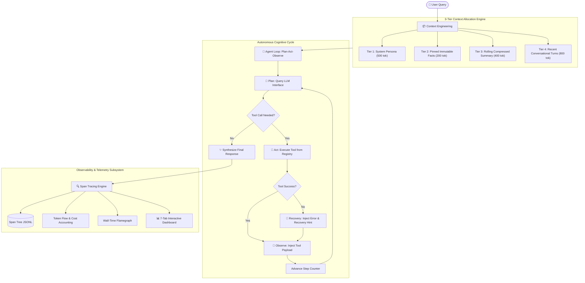
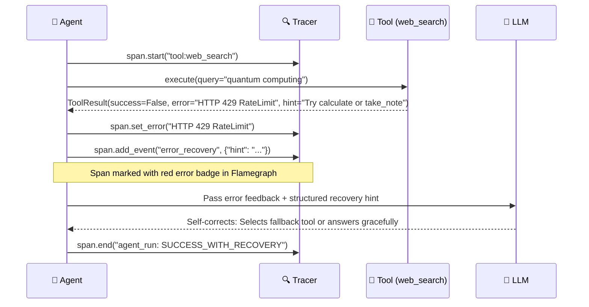

# 🔮 Prism — The Glass Box AI Agent

<p align="center">
  
  <a href="https://prisms.streamlit.app/"></a>
  
</p>

<p align="center">
  
  
  
  
  
  
</p>

---

<p align="center">
  <strong>An autonomous AI research agent designed with 100% transparent telemetry.</strong><br>
  Every cognitive decision, tool invocation, token allocation, and financial cost is traced, visualized, and reproducible down to the microsecond.
</p>

<p align="center">
  <a href="https://prisms.streamlit.app/"><strong>🚀 Launch Live Streamlit Demo</strong></a> •
  <a href="#-the-glass-box-problem"><strong>The Problem</strong></a> •
  <a href="#-system-architecture"><strong>Architecture</strong></a> •
  <a href="#-multi-model-inference-engine"><strong>Multi-Model Engine</strong></a> •
  <a href="#-quickstart"><strong>Quickstart</strong></a> •
  <a href="#-evaluation-suite--benchmarks"><strong>Eval Benchmarks</strong></a>
</p>

---

## Executive Summary

Modern AI systems are plagued by opacity: when an agent pipeline fails, halts in an infinite loop, hallucinates, or exhausts token quotas, engineers are left with cryptic exceptions and no root-cause telemetry. 

**Prism** solves **Track 1: "The Glass Box Problem"** at **Epochesque 2.0**. It is a fully observable, multi-tool autonomous agent built from ground-up fundamentals in native Python (without black-box agent frameworks like LangChain or AutoGen). Prism features:

1. **Hierarchical Span Tracing**: Microsecond-precision parent-child spans recording the causal provenance of every action, token count, cost, and tool payload.
2. **Autonomous Tool Failure Recovery**: A robust error recovery arc that catches tool failures, generates actionable recovery hints, and allows the LLM to self-correct without pipeline disruption.
3. **3-Tier Dynamic Context Engineering**: A bounded context allocation engine (sliding recent turns + rolling summaries + pinned user facts) rigorously proven across 20+ turns without context overflow.
4. **Dual Telemetry Dashboards**: A live interactive Streamlit Cloud web application and an exportable, self-contained interactive HTML/Netlify dashboard with 7 visual analytics tabs.
5. **Universal Inference Engine**: Out-of-the-box support for high-speed free-tier models (Groq Llama 3.3 70B @ 500+ tok/s, OpenRouter free models, Google Gemini 3.6 Flash) plus OpenAI, Claude, and an offline Deterministic benchmark engine.

---

## 🧩 The Glass Box Problem

> *"Your AI pipeline works today. Nobody knows why it will break tomorrow, and when it does, nobody can tell what went wrong."*  
> — **Epochesque 2.0, Track 1 Prompt**

```
❌ THE BLACK BOX PARADIGM                    ✅ THE PRISM GLASS BOX PARADIGM
┌───────────────────────────────┐           ┌────────────────────────────────────────────────────────┐
│ User Prompt                   │           │ User Prompt                                            │
│        │                      │           │        │                                               │
│        ▼                      │           │        ▼                                               │
│  [ ??? BLACK BOX ??? ]        │           │  [ Hierarchical Trace Tree & Causal Provenance ]       │
│  - Hidden prompt bloating     │           │  ├── 📦 context_engineering (3-tier dynamic budget)     │
│  - Untracked token costs      │           │  ├── 🤖 step_1: plan -> 🧠 llm:plan_and_act (185 tok)  │
│  - Silent tool crash          │    VS     │  ├── 🔧 tool:web_search [HTTP 500: RateLimited]        │
│  - No error explanation       │           │  ├── 🔄 recovery_arc: hint injected -> retry alternate │
│        │                      │           │  ├── 🤖 step_2: plan -> 🧠 llm:plan_and_act (312 tok)  │
│        ▼                      │           │  └── 🏁 synthesized_response (Citations Attached)      │
│ Opaque Output or Unhandled 500│           │        │                                               │
└───────────────────────────────┘           │        ▼                                               │
                                            │ Transparent Answer + Flamegraph + Micro-Cost Tracking  │
                                            └────────────────────────────────────────────────────────┘
```

### Architectural Comparison

| Capability | Standard Agent Frameworks | Prism Architecture |
| :--- | :--- | :--- |
| **Telemetry & Observability** | Opaque log dumps or proprietary SaaS locks (LangSmith, Datadog) | **Zero-dependency, open JSONL span tree with instant local/cloud dashboard** |
| **Context Window Control** | Blind naive concatenation leading to sudden context overflows | **3-Tier Token Budget: sliding window + rolling summary + immutable key facts** |
| **Failure Recovery** | Aborts process or crashes unhandled | **Structured `ToolResult` schemas with error hints and multi-step self-correction** |
| **Financial Accounting** | Approximate post-hoc estimations | **Exact per-span input/output token metering & dollar pricing down to $0.000001** |
| **Reproducibility** | Flaky stochastic evaluations dependent on live network & rate limits | **100% offline, deterministic evaluation suite (10 scenarios, 67 assertions)** |
| **Framework Overhead** | Hundreds of convoluted wrapper abstractions | **Native Python 3.10+ standard library + lightweight REST requests** |

---

## 🏛️ System Architecture

Prism operates on a rigorous **Plan → Act → Observe → Synthesize** closed-loop state machine. Every component is wrapped by a hierarchical `Tracer` generating nested OpenTelemetry-compatible spans.



---

## ⚡ Multi-Model Inference Engine

Prism features a provider-agnostic LLM interface built with **direct zero-dependency REST clients**, bypassing bloated SDKs and avoiding gRPC or C-extension version conflicts.

```
                         ┌─────────────────────────────────┐
                         │   prism.llm.create_llm(...)     │
                         └───────────────┬─────────────────┘
                                         │
       ┌──────────────────┬──────────────┼─────────────────┬──────────────────┐
       ▼                  ▼              ▼                 ▼                  ▼
┌──────────────┐   ┌──────────────┐┌──────────────┐  ┌──────────────┐   ┌──────────────┐
│  ⚡ Groq     │   │ 🌐 OpenRouter││ 💎 Gemini    │  │ 🧠 OpenAI    │   │ 🤖 Determ.   │
│ Llama 3.3 70B│   │ Free Models  ││ 3.6 Flash    │  │ GPT-4o-mini  │   │ Offline Stub │
│ 500+ tok/s   │   │ Open Source  ││ Native REST  │  │ GPT-4o       │   │ 100% CI Eval │
└──────────────┘   └──────────────┘└──────────────┘  └──────────────┘   └──────────────┘
```

### Supported Providers & Free Tiers

| Provider | Default Model | Speed | Cost | Ideal Use Case |
| :--- | :--- | :--- | :--- | :--- |
| **Groq** *(Recommended Free Tier)* | `openai/gpt-oss-120b` / `compound` | **500+ tok/s** | **Free Tier** (14,400 req/day) | Ultra-fast live agent demonstrations, low latency, no credit card required. |
| **OpenRouter** *(Free Tier)* | `meta-llama/llama-3.3-70b-instruct:free` | ~40-70 tok/s | **100% Free** | Open-source ecosystem, exploration, community models. |
| **Google Gemini** | `gemini-3.6-flash` | ~90 tok/s | Free Tier / PayG | Multimodal reasoning, deep context exploration. |
| **OpenAI** | `gpt-4o-mini`, `gpt-4o` | ~80 tok/s | Pay-as-you-go | Standard enterprise production deployments. |
| **Anthropic** | `claude-haiku-3.5`, `claude-sonnet-3.5` | ~70 tok/s | Pay-as-you-go | Complex multi-step reasoning and synthesis. |
| **Deterministic Engine** | `deterministic` | **Instant (<1ms)** | **$0.000000** | **100% offline, zero-network reproducible unit & eval testing.** |

> 💡 **Get Free Keys in 30 Seconds**:
> - **Groq Free Key**: [console.groq.com/keys](https://console.groq.com/keys) *(Instant, no credit card required)*
> - **OpenRouter Free Key**: [openrouter.ai/keys](https://openrouter.ai/keys)
> - **Google Gemini Key**: [aistudio.google.com](https://aistudio.google.com)

---

## 🛠️ Tool Registry & Failure Recovery Arc

Prism equips the agent with 5 native tools. Unlike naive agent systems that pass unvalidated strings, every Prism tool returns a strictly typed `ToolResult`:

```python
@dataclass
class ToolResult:
    success: bool
    data: Any = None
    error: str | None = None
    hint: str | None = None  # Causal guidance for the LLM to self-correct
```

### Available Tools

1. **`web_search`**: DuckDuckGo instant answer search with structured snippets.
2. **`read_url`**: HTML content extraction and semantic text parsing.
3. **`calculate`**: Sandboxed AST-evaluated mathematical calculation engine.
4. **`analyze_data`**: Statistical summarization, numeric aggregation, and distribution profiling.
5. **`take_note`**: Persistent session scratchpad for multi-step research synthesis.

### The Failure Recovery Arc (Rule Compliance)

Hackathon Track 1 explicitly requires proving how tracing catches and recovers from real-world failures. Prism demonstrates this deterministically:



---

## 📦 3-Tier Dynamic Context Engineering

To satisfy the **15–20+ turn conversation requirement** without catastrophic context window overflow or forgetting user instructions, Prism implements a dynamic 3-tier token memory manager:

```
┌─────────────────────────────────────────────────────────────────────────────┐
│                    PRISM CONTEXT ALLOCATION (3,500 Tokens)                  │
├────────────────────────────────┬────────────────────────────────────────────┤
│ 1. System Persona (500 tok)    │ Permanent operational instructions & tools │
├────────────────────────────────┼────────────────────────────────────────────┤
│ 2. Pinned Key Facts (200 tok)  │ Critical user preferences that NEVER expire│
├────────────────────────────────┼────────────────────────────────────────────┤
│ 3. Rolling Summary (400 tok)   │ Iterative semantic compression of old turns│
├────────────────────────────────┼────────────────────────────────────────────┤
│ 4. Sliding Window (800 tok)    │ Verbatim preservation of latest turns      │
├────────────────────────────────┼────────────────────────────────────────────┤
│ 5. Reserved Headroom (1,600 tok│ Safety margin for generation & tool payloads│
└────────────────────────────────┴────────────────────────────────────────────┘
```

- When conversation history exceeds the sliding window threshold, turns are not dropped—they are progressively summarized into Tier 3.
- Key facts (e.g. user constraints, tech stack preferences) are isolated in Tier 2 and protected against compression.
- Evaluated and verified across **20 consecutive conversational turns** in Scenario `s05_long_conversation` with zero token leakage.

---

## 📊 Dual Observability Dashboards

Prism provides observability through two distinct interfaces:

### 1. Interactive Streamlit Web Application (`app.py`)
Deployed live on Streamlit Community Cloud: **[https://prisms.streamlit.app/](https://prisms.streamlit.app/)**
- Real-time chat streaming with live agent step indicators.
- One-click failure mode injection (`Simulate Search Failure`, `Simulate URL Failure`) to verify recovery arcs live.
- Model switcher: Instant dropdown between **Groq (Free)**, **OpenRouter (Free)**, **Google Gemini**, **OpenAI**, **Anthropic**, and **Deterministic**.
- Full interactive telemetry tab suite rendered via Plotly.

### 2. Static Netlify / HTML Artifact Dashboard (`public/index.html`)
- Zero-dependency, self-contained single-page dashboard with embedded dark-mode CSS and JavaScript.
- Deployed on Netlify or viewable locally in any browser via `python prism/cli.py -> :dashboard`.
- **7 Telemetry Tabs**:
  1. **Span Tree**: Hierarchical collapsible tree with duration, token counts, and error highlights.
  2. **Flamegraph**: Proportional wall-time horizontal waterfall chart.
  3. **Token Flow**: Input vs. output token distribution per reasoning phase.
  4. **Context Window**: Stacked visual breakdown of memory tiers across turns.
  5. **Tool Usage**: Call frequencies, latency distributions, and reliability rates.
  6. **Failure Recovery**: Dedicated inspector for errors caught, root-cause exceptions, and recovery hints.
  7. **Conversation Replay**: Step-by-step turn replay with "Under the Hood" cognitive inspector.

---

## 🚀 Quickstart

### 1. Clone & Install

```bash
git clone https://github.com/ReasonableExcuses/prism.git
cd prism
pip install -r requirements.txt
```

### 2. Run the Evaluation Suite (100% Offline, Zero Key Required)

```bash
python evals/run_evals.py -v
```

### 3. Launch the Interactive Web App

```bash
streamlit run app.py
```
*Access the local web dashboard at `http://localhost:8501`.*

### 4. Launch the Interactive Terminal CLI (REPL)

```bash
# Offline deterministic mode (no key needed)
python prism/cli.py

# Ultra-fast Groq free tier
python prism/cli.py --llm groq

# Google Gemini 3.6 Flash
python prism/cli.py --llm gemini

# OpenAI GPT-4o-mini
python prism/cli.py --llm openai
```

#### CLI In-Session Commands
| Command | Action |
| :--- | :--- |
| `:trace` | Print formatted ASCII span tree with micro-timings and token counts |
| `:cost` | Print cumulative input/output tokens and financial cost in USD |
| `:context` | Display current 3-tier context allocation and memory budget |
| `:fail` | Deliberately trigger tool failures to observe real-time recovery |
| `:unfail` | Restore tool operational health |
| `:dashboard` | Generate self-contained HTML dashboard and launch browser |
| `:history` | Display full conversational turns and rolling summaries |
| `:notes` | View current persistent research scratchpad |

---

## 🧪 Evaluation Suite & Benchmarks

Prism is backed by a deterministic evaluation harness that validates every system invariant without external network calls:

```
════════════════════════════════════════════════════════════
  🔮 PRISM EVALUATION BENCHMARK
════════════════════════════════════════════════════════════
```

| ID | Scenario | Verification Scope | Assertions | Status |
| :--- | :--- | :--- | :---: | :---: |
| `s01` | `basic_trace` | Root span creation, LLM span tracking, token accounting | 5 / 5 | ✅ PASS |
| `s02` | `tool_trace` | Tool span attributes, argument logging, duration capture | 3 / 3 | ✅ PASS |
| `s03` | `nested_spans` | Parent-child relationship integrity across agent loop | 4 / 4 | ✅ PASS |
| `s04` | `failure_recovery` | Tool failure capture, error attribution, graceful fallback | 3 / 3 | ✅ PASS |
| `s05` | `long_conversation` | 20-turn conversation integrity and context survival | 23 / 23 | ✅ PASS |
| `s06` | `context_budget` | Strict enforcement of token limits across all memory tiers | 11 / 11 | ✅ PASS |
| `s07` | `rolling_summary` | Semantic compression of old turns into rolling summary | 2 / 2 | ✅ PASS |
| `s08` | `cost_tracking` | Cumulative financial metering and token aggregation | 4 / 4 | ✅ PASS |
| `s09` | `multi_tool` | Dynamic routing between search, calculation, and analysis | 3 / 3 | ✅ PASS |
| `s10` | `dashboard_gen` | HTML dashboard generation with all 7 analytical panels | 9 / 9 | ✅ PASS |
| **Total** | **Full Benchmark** | **End-to-End System Reliability** | **67 / 67** | **100% PASS** |

*Benchmark execution time: **~8.1 seconds** on standard hardware.*


---

## 📁 Repository Structure

```
prism/
├── prism/                      # Core Prism Architecture
│   ├── __init__.py             # Package exports & public API
│   ├── trace.py                # 🔍 Span-level tracing engine & OpenTelemetry schemas
│   ├── llm.py                  # 🧠 Universal LLM client (Groq, OpenRouter, Gemini, OpenAI, Claude)
│   ├── tools.py                # 🔧 5 native tools with structured ToolResult & error hints
│   ├── context.py              # 📦 3-tier dynamic context budget manager
│   ├── agent.py                # 🤖 Autonomous Plan-Act-Observe cognitive cycle
│   ├── cli.py                  # 💻 Interactive REPL with in-terminal observability
│   └── dashboard.py            # 📊 Self-contained interactive HTML dashboard generator
│
├── evals/                      # Deterministic Evaluation Harness
│   ├── harness.py              # Test runner and assertion framework
│   ├── scenarios.py            # 10 rigorous evaluation scenarios (67 assertions)
│   └── run_evals.py            # CLI entrypoint for test suite
│
├── app.py                      # 🔮 Streamlit Cloud live application & real-time telemetry
├── .streamlit/config.toml      # Production UI styling & dark theme tokens
├── public/index.html           # 🌐 Pre-built static telemetry dashboard for Netlify hosting
├── netlify.toml                # Netlify deployment configuration
├── scripts/                    # Utility scripts (e.g. generate_demo_dashboard.py)
├── requirements.txt            # Minimal runtime dependencies
└── README.md                   # System documentation & hackathon submission
```

---

## 🔒 Security & Privacy Guarantees

- **No Third-Party Telemetry Leaks**: Tracing telemetry is generated strictly on-device/in-process. No traces are transmitted to third-party observability SaaS platforms.
- **Zero Hardcoded Secrets**: All API keys are loaded via runtime environment variables or masked UI inputs; zero keys are committed to source control.
- **Safe Sandboxed Execution**: The `calculate` tool uses Python's `ast.parse` and operator whitelisting rather than dangerous `eval()` or `exec()`.

---

## 👥 Team & Acknowledgments

Built with precision for **Epochesque 2.0** by **Team Imagine Losing**.

- **Live Streamlit App**: [https://prisms.streamlit.app/](https://prisms.streamlit.app/)
- **GitHub Repository**: [https://github.com/ReasonableExcuses/prism](https://github.com/ReasonableExcuses/prism)
- **License**: [MIT License](LICENSE)
